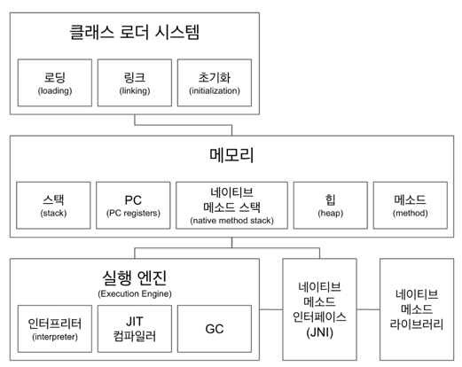
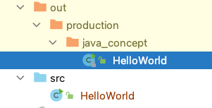
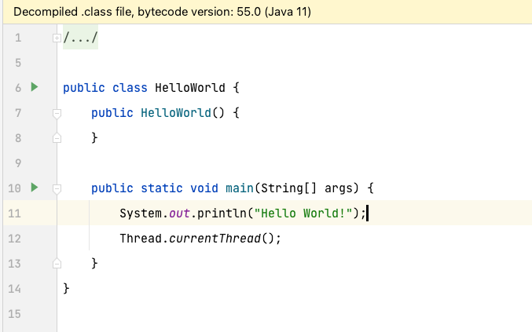
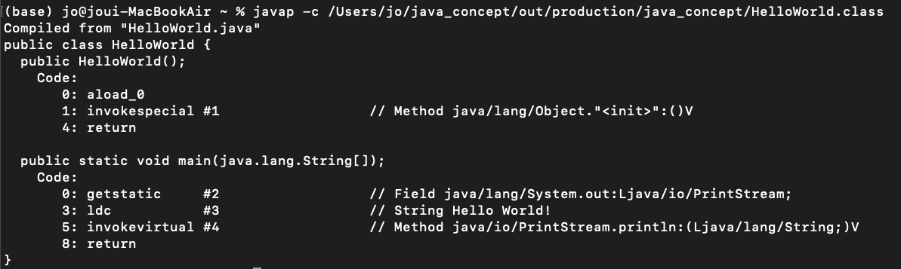
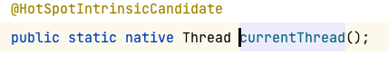
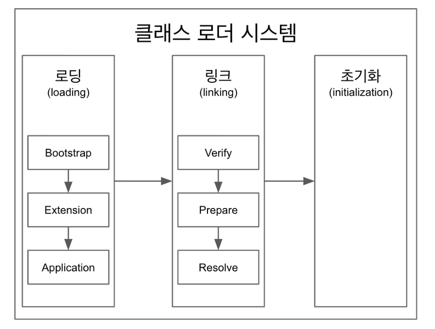
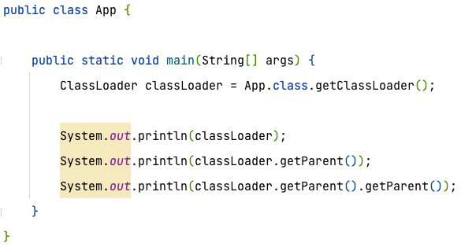
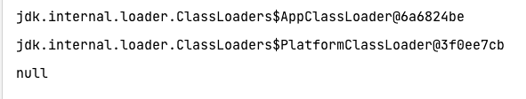
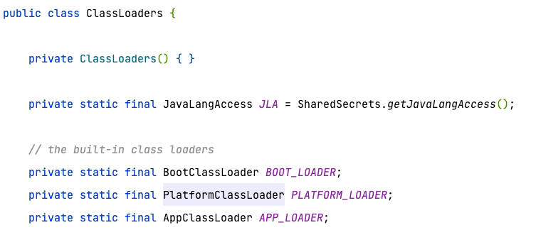

# JVM (Java Virtual Machine)

## Class Loader 시스템
- .class 에서 바이트코드를 읽고 메모리에 저장
  

 
- HelloWorld.java 파일의 바이트 코드는 HelloWorld.class 파일
  

 
- 위 그림은 HelloWorld.class 파일임. 
- .class 파일은 byte 코드인데 왜 저렇게 생겼지?? --> Decompilede 되어 보여짐
  

 
- 실제 바이트 코드는 위 그림과 같음
  

### 로딩
: 클래스 읽어오는 과정
### 링크
: 레퍼런스를 연결하는 과정
### 초기화
: static 값들 초기화 및 변수에 할당
 
* 로딩 -> 링크 -> 초기화 순서
 
## Memory
- 메모리 영역에는 클래스 수준의 정보 (클래스 이름, 부모 클래스 이름, 메서드, 변수) 저장. --> 공유 자원 임
- 힙 영역에는 객체를 저장 --> 공유 자원 임
- 스택 영역에는 쓰레드마다 런타임 스택을 만들고 그 안에 메서드 호출을 스택 프레임이라 불리는 블럭으로 쌓음. 쓰레드가 종료되면 런타임 스택도 사라짐.
- PC(Program Counter) 레지스터 : 쓰레드 마다 쓰레드 내 현재 실행할 스택 프레임을 가리키는 포인터가 생성됨.
- 네이티브 메서드 스택
## 실행 엔진
- 인터프리터 : 바이트 코드를 한줄 씩 실행.
- JIT 컴파일러 : 인터프리터 효율을 높이기 위해 인터프리터가 반복되는 코드를 발견하면 JIT 컴파일러로 반복되는 코드를 모두 네이티브 코드로 바꿔둠. 그 다음부터 인터프리터는 네이티브 코드로 컴파일된 코드를 바로 사용.
- GC(Garbage Collector) : 더 이상 참조되지 않는 객체를 모아서 정리.
## JNI(Java Native Interface)
- 자바 애플리케이션에서 C, C++, 어셈블리어로 작성된 함수를 사용할 수 있는 방법 제공.
- Native 키워드를 사용한 메서드 호출
## Native Method Library
- C, C++로 작성 된 라이브러리  
ex)  

## Class Loader

클래스 로더는 계층 구조로 이루어져 있으며 기본적으로 세가지 클래스 로더가 제공

1. BootStrap Class Loader : JAVA_HOME\lib에 있는 코어 자바 API를 제공. 최상위 우선순위를 가진 클래스 로더
2. Platform Class Loader : JAVA_HOME\lib\ext 폴더 또는 java.ext.dirs 시스템 변수에 해당하는 위치에 있는 클래스를 읽음.
3. Application Class Loader : 애플리케이션 클래스패스(애플리케이션 실행할때 주는 -classpath 옵션 또는 java.class.path 환경 변수의 값에 해당하는 위치)에서 클래스를 읽음.
 
 
 

App이라는 클래스를 만든 후 해당 클래스의 클래스 로더를 출력해보면 Application Class Loader(AppClassLoader)가 나오고 
해당 클래스의 클래스로더의 부모 클래스 로더는 PlatformClassLoader가 나온다. 
PlatformClassLoader의 부모 클래스 로더를 확인해보면 null이 나오는 것을 확인할 수 있다. 
 

BootStrap Class Loader가 나와야 하는 것 아닌가? 
실제로는 존재하지만 BootStrap Class Loader는 native code로 구현되어 있어 자바 코드로 볼 수 없을 뿐   

 

### 클래스 로더가 동작하는 원리
1. 어떤 클래스를 읽어야 할 가장 먼저 제일 부모 즉 Bootstrap Class Loader가 읽어 오기 시도
2. Bootstrap Class Loader가 못 읽어올 시 Flatform Class Loader가 읽어 오기 시도
3. Platform Class Loader도 못 읽어올 시 Application Class Loader가 읽어 옴.
4. 이 때도 못 읽어오면 Class Not Found Exception이 발생.
 

* 로딩, 링크, 초기화 순으로 진행

### 로딩
- 클래드 로더가 .class 파일을 읽고 그 내용에 따라 적절한 바이너리 데이터를 만들고 "메서드" 영역에 저장.
- 이때 메서드 영역에 저장하는 데이터
  - FQCN
  - 클래스 | 인터페이스 | enum
  - 메서드와 변수
- 로딩이 끝나면 해당 클래스 타입의 Class 객체를 생성하여 힙 영역에 저장.
### 링크
- Verify, Prepare, Resolve(optional) 세 단계로 나눠져 있음.
- Verify(검증) : .class 파일 형식이 유효한지 체크함.
- Preparation : 클래스 변수(static 변수)와 기본값에 필요한 메모리
- Resolve : 심볼릭 메모리 레퍼런스를 메서드 영역에 있는 실제 레퍼런스로 교체. (optional)
### 초기화
- static 변수의 값을 할당 (static 블럭이 있다면 이때 실행 됨)

## Reference
강의: 더 자바, 코드를 조작하는 다양한 방법 (백기선)
