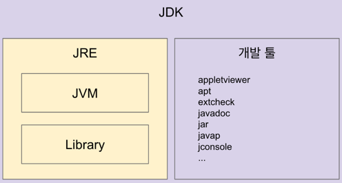

# 자바 내부 구조를 알아보자.

## 자바
- 프로그래밍언어
- JDK에 들어있는 자바 컴파일러(javac)를 사용해서 바이트코드(.class 파일)로 컴파일 가능

## JVM (Java Virtual Machine)
- 자바 가상 머신으로 자바 바이트코드 (.class 파일)를 OS에 특화된 코드로 변환(Interpreter와 JIT Compiler)하여 실행.
- 바이트 코드를 실행하는 표준(JVM 자체는 표준)이자 구현체(특정 Vendor가 구현한 JVM)다.
- 특정 플랫폼에 종속적이다.

### JVM Vendor
: 오라클, 아마존, Azul, ~~~

### JVM 언어
: JVM 기반으로 동작하는 프로그래밍 언어
- Clojure, Groovy, JRuby, Jython, Kotlin, Scala, ~~~

## JRE (Java Runtime Environment)
: JVM + 라이브러리
- 자바 애플리케이션을 실행할 수 있도록 구성된 배포판.
- JVM과 핵심 라이브러리 및 자바 런타임 환경에서 사용하는 프로퍼티 세팅이나 리소스 파일을 가지고 있음.
- 개발 관련 도구는 포함하지 않음 (해당 도구들은 JDK에서 제공)

## JDK (Java Development Kit)
: JRE + 개발 툴
- 소스 코드를 작성할 때 사용하는 자바 언어는 플랫폼에 독립적
  - 오라클은 자바 11부터는 JDK만 제공하고 JRE를 따로 제공하지 않음.
  - Write Once Run Anywhere

## Reference
강의: 더 자바, 코드를 조작하는 다양한 방법 (백기선)
